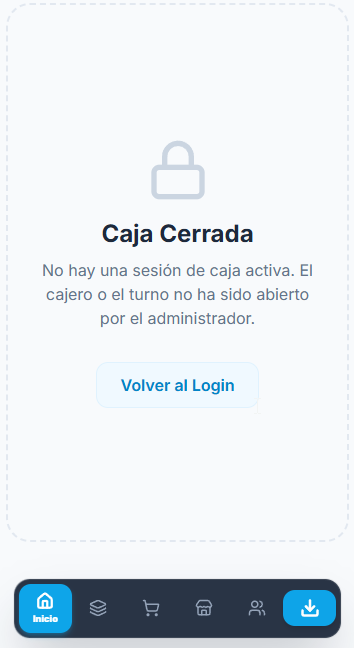

# 🎱 Pool Los Diaz — Hoja de Ruta del Sistema

> **Versión:** 1.0  
> **Proyecto:** Pool Los Diaz POS  
> **Supabase Ref:** `raxcxddreghynthyvllh`  
> **Stack:** React + Vite + Supabase + LocalForage (PWA Offline-First)

---

## 🎯 Visión General

Sistema de punto de venta especializado para un salón de billar, con gestión de mesas, órdenes de consumo, control de caja y reportes financieros. Diseñado para funcionar 100% offline con sincronización en la nube mediante Supabase.

---

## FASE 1 — Autenticación por PIN y Roles de Personal 🔄 (COMPLETADA)

**Objetivo:** Controlar el acceso al sistema por rol, sin necesidad de contraseñas complejas. Cada empleado se identifica con su nombre y un PIN de 4 dígitos.

### Entregables
- [x] Tabla `staff_users` en Supabase (id, nombre, rol, pin_hash, activo)
- [x] Store de autenticación `authStore.js` con caché offline en LocalForage
- [x] Utilidad `crypto.js` para hashing SHA-256 del PIN (Web Crypto API nativa)
- [x] Componente `LoginScreen.jsx` — Pantalla completa de acceso por PIN
- [x] Componente `PinPad.jsx` — Teclado numérico táctil + selector de nombre
- [x] Guards de ruta: `<AdminRoute>`, `<CashierRoute>`, `<AnyStaffRoute>`
- [x] Integración en `App.jsx` para interceptar acceso no autenticado

### Roles del sistema
| Rol | Descripción | Permisos |
|-----|------------|----------|
| `ADMIN` | Dueño / Gerente | Acceso total. Configuración, reportes, caja, mesas |
| `CAJERO` | Cajero | Ventas, cobros, cierre de caja |
| `MESERO` | Mesero / Operador | Asignar mesas, registrar órdenes |

---

## FASE 2 — Plano Interactivo de Mesas de Pool ✅ (COMPLETADA)

**Objetivo:** Vista principal de operación. El operador ve el estado de cada mesa en tiempo real y puede asignar sesiones, ver timers y cobrar.

### Entregables
- [x] Tabla `tables` en Supabase (id, nombre, tipo, estado, precio/hora, posición x/y)
- [x] Tabla `table_sessions` (mesa, mesero, hora inicio, hora fin, tiempo pagado, estado)
- [x] Vista `TablesView.jsx` — Plano visual con tarjetas de mesas
- [x] Componente `TableCard.jsx` — Muestra estado, timer regresivo y precio acumulado
- [x] Motor de timers con `expires_at` y alertas configurables (ej. 10 min antes de vencer)
- [x] Acciones por mesa: Abrir sesión / Agregar tiempo / Cerrar y cobrar
- [x] Sincronización en tiempo real con Supabase Realtime

### Estados de mesa
| Estado | Color | Significado |
|--------|-------|-------------|
| `LIBRE` | 🟢 Verde | Disponible para asignar |
| `OCUPADA` | 🔴 Rojo | Sesión activa con timer corriendo |
| `PIÑA` | 🟡 Amarillo | Sesión activa de tipo cobro plano |
| `MANTENIMIENTO` | ⚫ Gris | Fuera de servicio |

---

## FASE 2.5 — Refinamiento Administrativo y UI Móvil ✅ (COMPLETADA)

**Objetivo:** Permitir al administrador autogestionar el plano estructural del bar (añadir/editar mesas) y optimizar la experiencia para los meseros en teléfonos.

### Entregables
- [x] Módulo Administrativo: CRUD de Mesas (Añadir mesas nuevas, cambiar nombres).
- [x] Tipos de Mesas: Soporte para 'Mesa de Pool' (con temporizador) vs 'Mesa Normal' (sólo para cargar consumo, sin costo por tiempo).
- [x] Filtros Dinámicos: Barra de filtros combinados por **Tipo** (Todas/Pool/Bar) y **Estado** (Libres/Ocupadas).
- [x] UI/UX Móvil: Optimización de la vista `TablesView.jsx` con diseño adhesivo (sticky) para filtros y contadores.

---

## FASE 3 — Sistema de Órdenes, Consumo y Cobro ✅ (COMPLETADA)

**Objetivo:** Vincular órdenes de consumo de barra a cada mesa, gestionar la expansión de tiempo y proveer un checkout robusto unificado (consumo + mesas).

### Entregables
- [x] Tabla `orders`, `order_items` y `payments`.
- [x] Componente `OrderPanel.jsx` — Re-diseñado en **Light Mode** y renombrado a "**Consumo**".
- [x] Modal de "Detalle de Cuenta": Desglose premium de tiempo (solo pool) e ítems consumidos con conversión dual ($/Bs).
- [x] Diferenciación visual: Esquemas de color únicos para mesas de Pool (Cielo) vs Mesas de Bar (Bulto/Violeta).
- [x] Motor de Impresión por Mesa: Capacidad de emitir un Ticket Parcial (cuenta temporal o saldo actual para el cliente).
- [x] Flujo de cobro integrado con el motor existente (`checkoutProcessor.js`).

---

## FASE 4 — Apertura y Cierre de Caja ✅ (COMPLETADA)

**Objetivo:** Control formal del dinero físico. El administrador abre la caja con un fondo inicial, el cajero opera, y al final del turno se realiza el arqueo y cierre.

### Entregables
- [x] Tabla `cash_sessions` (fondo inicial USD/Bs, tasas del momento, estado, arqueo, cajero)
- [x] Pantalla de **Apertura de Caja** — Ingreso de fondo inicial y verificación de tasas
- [x] Bloqueo de acceso para cajeros/meseros si no hay caja abierta
- [x] Vista de **Cierre de Caja** — Arqueo físico vs sistema, diferencias en USD y Bs (Cierre Ciego implementado)
- [x] Generación de Ticket Térmico/PDF de cierre de caja (`dailyCloseGenerator.js`)
- [x] Historial de sesiones de caja visualizado en `ReportsView.jsx`

---

## FASE 5 — Inventario de Barra y Cocina ✅ (COMPLETADA)

**Objetivo:** Control de stock de los productos vendidos en el salón (bebidas, snacks, insumos). Descuento automático de inventario al procesar una orden. *(Esta fase se autocompletó gracias a la migración total de componentes desde Abasto)*.

### Entregables
- [x] Integración del catálogo de productos existente con la nueva tabla `products` en Supabase
- [x] Descuento automático de stock al confirmar una orden (`process_checkout` RPC)
- [x] Alertas de stock bajo configurables por producto
- [x] Vista de inventario con filtros por categoría (Bebidas, Snacks, Insumos de mesa)
- [x] Módulo de ajuste de inventario (entradas, salidas manuales, mermas)
- [x] Reporte de rotación de productos integrado en el cierre del día

---

## 🗓️ Cronograma Estimado

```
ABR 2026   ████████░░░░░░░░░░░░  FASE 1 — Login y Roles
MAY 2026   ██████████████████░░  FASE 2 — Plano y Refinamiento (Filtrado)
JUN 2026   ███████████████░░░░░  FASE 3 — Órdenes y Consumo
JUL 2026   ████████████████████  FASE 4 — Apertura y Cierre de Caja
AGO 2026   ████████████████████  FASE 5 — Inventario de Barra
```

---

## 🏗️ Arquitectura Técnica

```
┌─────────────────────────────────────────────┐
│               Pool Los Diaz PWA              │
├─────────────────┬───────────────────────────┤
│   Capa de UI    │  React + Tailwind CSS      │
├─────────────────┼───────────────────────────┤
│ Estado / Lógica │  Zustand + React Context  │
├─────────────────┼───────────────────────────┤
│  Persistencia   │  LocalForage (Offline)    │
│  Local          │  IndexedDB bajo el capó   │
├─────────────────┼───────────────────────────┤
│  Sincronización │  useCloudSync.js (P2P)    │
│  en Tiempo Real │  Supabase Realtime        │
├─────────────────┼───────────────────────────┤
│  Base de Datos  │  Supabase PostgreSQL      │
│  Remota         │  RPCs transaccionales     │
└─────────────────┴───────────────────────────┘
```

---

## 📐 Reglas Inamovibles del Sistema

> Estas reglas deben respetarse en cada fase sin excepción.

1. **Offline-First**: Toda acción debe funcionar sin internet. La sincronización es eventual, nunca bloqueante.
2. **PIN Hasheado**: Ningún PIN se almacena en texto plano — siempre SHA-256.
3. **Doble Partida**: Cada venta genera un par débito/crédito para garantizar integridad contable.
4. **Impresora 58mm**: Todos los documentos de impresión están optimizados para papel térmico de 58mm.
5. **Moneda base USD**: El sistema opera en USD como unidad de cuenta. Bs y COP son conversiones dinámicas.
6. **RLS Permisivo**: La seguridad de acceso se gestiona en el cliente (Guards), no en políticas de RLS de Supabase, para maximizar la compatibilidad offline.

---

## 🔧 Estado Actual del Proyecto (Abril 2026)

| Tema | Estado |
|-----------|--------|
| Branding "Pool Los Diaz" | ✅ Completo |
| Motor de ventas (`checkoutProcessor`) | ✅ Operativo |
| Cola offline (`offlineQueueService`) | ✅ Operativa |
| Sincronización P2P (`useCloudSync`) | ✅ Operativa |
| Funciones RPC Supabase (`process_checkout`) | ✅ Desplegadas |
| Tickets térmicos 58mm | ✅ Calibrado |
| Sistema de Login por PIN | ✅ Completo (Fase 1) |
| Plano de Mesas con Timers | ✅ Completo (Fase 2) |
| Apertura / Cierre de Caja | ✅ Completo (Fase 4) |
| Órdenes y Comandas | ✅ Completo (Fase 3) |
| Inventario de Barra | ✅ Completo (Fase 5) |
